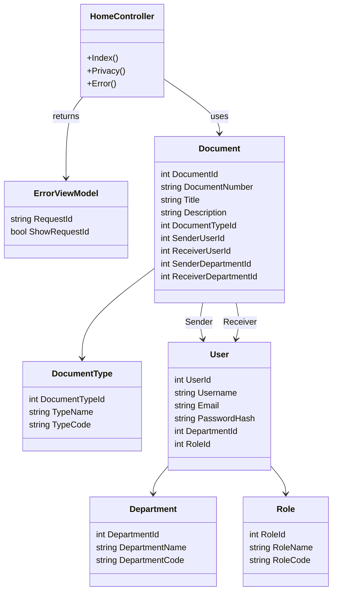

# Muhaberat Evrak Yönetim Sistemi Class Diagram

Below is a simplified MVC-focused class diagram for the application.

This diagram focuses on the main classes and their relationships without introducing additional layers or services. It represents an MVC structure where the `HomeController` interacts directly with models and views.
